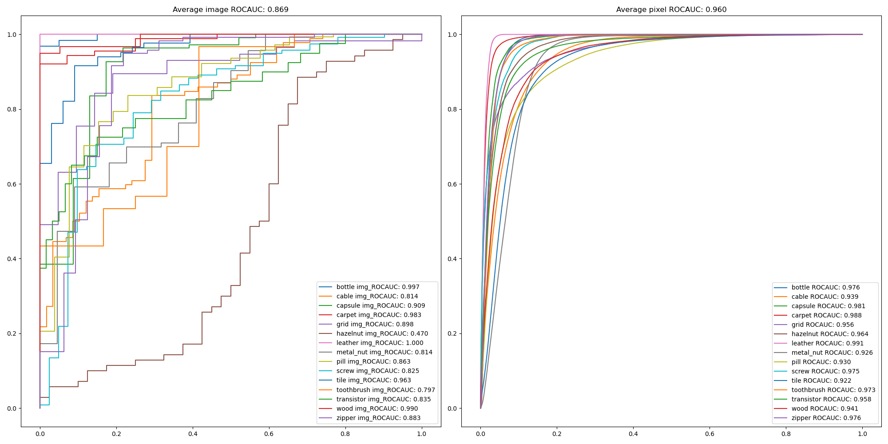

# PaDiM-Anomaly-Detection-Localization-master
This is an implementation of the paper [PaDiM: a Patch Distribution Modeling Framework for Anomaly Detection and Localization](https://arxiv.org/pdf/2011.08785).   

This code is heavily borrowed from both SPADE-pytorch(https://github.com/byungjae89/SPADE-pytorch) and MahalanobisAD-pytorch(https://github.com/byungjae89/MahalanobisAD-pytorch) projects.

    

## Requirement
* python == 3.7
* pytorch == 1.5
* tqdm
* sklearn
* matplotlib

## Datasets
MVTec AD datasets : Download from [MVTec website](https://www.mvtec.com/company/research/datasets/mvtec-ad/)

## Results On ResNet18

### ROC Curve

    

### Localization results

    

    

    

    

    

    

    

    

    

    

    

    

    

    

    

## Reference
[1] Thomas Defard, Aleksandr Setkov, Angelique Loesch, Romaric Audigier. *PaDiM: a Patch Distribution Modeling Framework for Anomaly Detection and Localization*. https://arxiv.org/pdf/2011.08785

[2] https://github.com/byungjae89/SPADE-pytorch

[3] https://github.com/byungjae89/MahalanobisAD-pytorch
